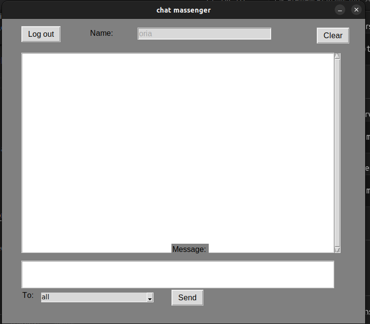

# Python Chat Application

## Description
This is a simple chat application built in Python. It consists of a client-server architecture where multiple clients can connect to the server to exchange messages.

This repository contain server and client with gui
the server handle messages for everyone and private messages

## Features
- Client-Server architecture
- Supports multiple clients
- Simple and lightweight

## Installation
1. Clone this repository:
   ```bash
   git clone https://github.com/oriazadok/chat_python.git
   ```
2. Navigate to the project directory:
   ```bash
   cd chat_python
   ```
3. Install any dependencies (if applicable):
   ```bash
   pip install -r requirements.txt
   ```
4. Ubuntu Users: Make sure you have tkinter installed:
   ```bash
   sudo apt install python3-tk
   ```

## How to Run
1. Start the server:
   ```bash
   python myserver.py
   ```
2. Start the client in a new terminal window:
   ```bash
   python myclient.py
   ```

## Screenshot


## License
This project is licensed under the MIT License.
